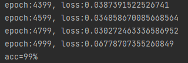

# Seq2seq-And-Attention

[TOC]

## 一：代码：

```python
import torch
import torch.nn as nn
import torch.nn.functional as F
import random
import string

class DataGenerator:
    def __init__(self, vocabulary_size, seq_len):
        self.vocabulary_size = vocabulary_size
        self.seq_len = seq_len

    def randomString(self):
        """Generate a random string with the combination of uppercase letters """
        letters = string.ascii_uppercase
        return ''.join(random.choice(letters) for i in range(self.seq_len))

    def get_batch(self, batch_size):
        batched_examples = [self.randomString() for i in range(batch_size)]
        enc_x = [[ord(ch) - ord('A') + 1 for ch in list(exp)] for exp in batched_examples]
        y = [[o for o in reversed(e_idx)] for e_idx in enc_x]
        dec_x = [[0] + e_idx[:-1] for e_idx in y]
        return (batched_examples, torch.tensor(enc_x), torch.tensor(dec_x), torch.tensor(y))


class Encoder(nn.Module):
    def __init__(self, hidden_size):
        super().__init__()
        self.encoder = nn.LSTM(input_size=hidden_size, hidden_size=hidden_size, batch_first=True)

    def forward(self, x):
        out, (h0, c0) = self.encoder((x))
        return out, (h0, c0)

class Decoder(nn.Module):
    def __init__(self, hidden_size):
        super().__init__()
        self.decoder = nn.LSTM(input_size=hidden_size, hidden_size=hidden_size, batch_first=True)

    def forward(self, x, hc):
        out, (h0, c0) = self.decoder((x), hc)
        return out, (h0, c0)

class Seq2seq(nn.Module):
    def __init__(self, hidden_size, vocabulary_size):
        super().__init__()
        self.embedding_enc = nn.Embedding(num_embeddings=vocabulary_size, embedding_dim=hidden_size)
        self.embedding_dec = nn.Embedding(num_embeddings=vocabulary_size, embedding_dim=hidden_size)
        self.encoder = Encoder(hidden_size)
        self.decoder = Decoder(hidden_size)
        self.liner = nn.Linear(in_features=hidden_size, out_features=vocabulary_size)

    def forward(self, enc_x, dec_x):
        enc_x = self.embedding_enc(enc_x)
        dec_x = self.embedding_dec(dec_x)

        _, enc_hc = self.encoder(enc_x)
        out, dec_hc = self.decoder(dec_x, enc_hc)
        out = self.liner(out)
        normal_out = F.log_softmax(out, dim=-1)
        return normal_out

class Seq2SeqModel:
    def __init__(self, data_generator, hidden_size, batch_size):
        self.data_generator = data_generator
        self.hidden_size = hidden_size
        self.batch_size = batch_size

        self.model = Seq2seq(hidden_size, data_generator.vocabulary_size)
        self.loss_fn = nn.CrossEntropyLoss()
        self.optimi = torch.optim.Adam(self.model.parameters(), lr=1e-4)

    def train(self, epochs):
        for i in range(epochs):
            _, enc_x, dec_x, y = self.data_generator.get_batch(self.batch_size)
            out = self.model(enc_x, dec_x)
            loss = 0
            for j in range(out.shape[0]):
                loss += self.loss_fn(out[j], y[j])
            loss /= out.shape[0]
            loss.backward()
            self.optimi.step()
            self.optimi.zero_grad()
            if (i + 1) % 200 == 0:
                print("epoch:{}, loss:{}".format(i, loss))

    def predict(self, test_epoch):
        results = []
        for _ in range(test_epoch):
            batch_examples, enc_x, dec_x, y = self.data_generator.get_batch(1)
            enc_x = self.model.embedding_enc(enc_x)
            _, hc = self.model.encoder(enc_x)
            y = torch.zeros([1, 1], dtype=torch.int32)
            pred = ''
            for _ in range(self.data_generator.seq_len):
                with torch.no_grad():
                    y = self.model.embedding_dec(y)
                    out, hc = self.model.decoder(y, hc)
                    out = self.model.liner(out)
                    y = out.argmax(-1)
                pred += chr(ord('A') + y.item() - 1)
            results.append(int(pred == ''.join(i for i in reversed(batch_examples[0]))))
        return results


if __name__ == '__main__':
    vocabulary_size = len(string.ascii_uppercase) + 1
    hidden_size = 200
    seq_len = 5
    batch_size = 10

    data_generator = DataGenerator(vocabulary_size, seq_len)
    seq2seq_model = Seq2SeqModel(data_generator, hidden_size, batch_size)

    # 训练模型
    seq2seq_model.train(5000)

    # 预测
    results = seq2seq_model.predict(100)

    # 输出准确率
    print("acc={}%".format(sum(results)))

    #result:
    # epoch: 3999, loss: 0.06591387093067169
    # epoch: 4199, loss: 0.05470824986696243
    # epoch: 4399, loss: 0.0387391522526741
    # epoch: 4599, loss: 0.034858670085668564
    # epoch: 4799, loss: 0.030272463336586952
    # epoch: 4999, loss: 0.06778707355260849
    # acc = 99 %
```

## 二：分析与结论：


### 1）模型设计：


### 2）代码结构说明：

#### 1. 概述：

​       这个 Python 脚本实现了一个序列到序列（seq2seq）模型，该模型主要用于字符串的反转任务。脚本主要包含以下几个类：

1. DataGenerator：负责生成训练和测试的数据。
2. Encoder：编码器，负责将输入序列转化为一个固定的上下文向量。
3. Decoder：解码器，负责将上下文向量转化为输出序列。
4. Seq2seq：主模型，包含编码器和解码器。
5. Seq2SeqModel：负责模型的训练和测试。

#### 2. 项目结构

```python
seq2seq-string-reversal/
|── main.py
|   |── DataGenerator
|   |   ├── __init__()
|   |   ├── randomString()
|   |   └── get_batch()
|   |
|   |── Encoder
|   |   ├── __init__()
|   |   └── forward()
|   |
|   |── Decoder
|   |   ├── __init__()
|   |   └── forward()
|   |
|   |── Seq2seq
|   |   ├── __init__()
|   |   └── forward()
|   |
|   |── Seq2SeqModel
|   |   ├── __init__()
|   |   ├── train()
|   |   └── predict()
|
└───

```

其中：

1. `main.py`：包含整个项目的所有代码。
2. `DataGenerator`：负责生成训练和测试数据的类。
3. `Encoder`：负责将输入序列编码为上下文向量的类。
4. `Decoder`：负责将上下文向量解码为输出序列的类。
5. `Seq2seq`：主模型，包含 `Encoder` 和 `Decoder`。
6. `Seq2SeqModel`：负责模型训练和预测的类。

#### 3. 详细说明

##### 3.1. DataGenerator 类

该类负责随机生成输入序列和目标序列。输入序列是由大写字母组成的随机字符串，目标序列是输入序列的反向字符串。在生成数据时，类将这些字符串转化为字母对应的 ASCII 码减去'A'的 ASCII 码得到的数值（以1为起始）。

##### 3.2. Encoder 类

Encoder 类实现了一个 LSTM 编码器。它的主要作用是将输入序列转化为一个固定长度的向量（也称为上下文向量）。在模型训练和测试过程中，这个向量用于在输入序列中捕捉和保存重要信息。

##### 3.3. Decoder 类

Decoder 类实现了一个 LSTM 解码器。它的主要作用是将上下文向量转化为目标序列。在训练过程中，它通过学习如何从上下文向量中获取信息来生成目标序列。

##### 3.4. Seq2seq 类

Seq2seq 类是模型的主体，包含了编码器和解码器。在前向传播过程中，它首先通过编码器将输入序列转化为上下文向量，然后通过解码器将上下文向量转化为输出序列。在生成输出序列时，模型使用线性层将 LSTM 的输出转化为词汇表大小的向量，然后通过 softmax 函数获取每个单词的概率。

##### 3.5. Seq2SeqModel 类

Seq2SeqModel 类主要负责模型的训练和测试。在训练过程中，它首先通过 DataGenerator 类生成训练数据，然后通过 Seq2seq 类生成输出序列，最后计算损失并优化模型的参数。在测试过程中，它生成测试数据，并使用训练好的模型生成输出序列，然后将输出序列与目标序列进行比较，以计算模型的准确率。

#### 4. 使用说明

1. 首先，你需要创建一个`DataGenerator`对象。这个对象将会生成训练和测试模型所需要的数据。

   ```python
   pythonCopy codevocabulary_size = len(string.ascii_uppercase) + 1
   seq_len = 5
   data_generator = DataGenerator(vocabulary_size, seq_len)
   ```

2. 然后，创建一个`Seq2SeqModel`对象，这个对象负责模型的训练和预测。

   ```python
   pythonCopy codehidden_size = 200
   batch_size = 10
   seq2seq_model = Seq2SeqModel(data_generator, hidden_size, batch_size)
   ```

3. 使用`Seq2SeqModel`对象的`train`方法来训练模型。这个方法需要一个参数，表示训练的轮数。

   ```python
   pythonCopy code
   seq2seq_model.train(5000)
   ```

4. 训练完模型后，你可以使用`predict`方法来预测数据。这个方法也需要一个参数，表示预测的轮数。`predict`方法将返回一个列表，列表中的每个元素表示一次预测的结果。

   ```python
   pythonCopy code
   results = seq2seq_model.predict(100)
   ```

5. 最后，你可以计算模型的准确率。准确率等于模型预测正确的次数除以总的预测次数。

   ```python
   pythonCopy code
   print("Accuracy: {}%".format(sum(results)))
   ```

### 3）结果展示：



### 4）结论：

​			这次实验感觉没有上一次难啊，就一个encoder一个decoder。然后生成数据集，训练就完成了。但是，众所周知，我是一个追求完美的男人，所以尽管模型很简单，不过我还是将他们全部完美的封装成了类，看起来结构清晰，令人爽心悦目，简直不要太完美。

​			同时呢，伴随着最后一个实验的完美落幕，这次的实验课也结束了。回顾往昔的实验，从各种回归到fc，到cnn再到rnn，说实话，我用了将近2年的时间菜彻底的搞懂了cnn的精髓，才体会到他卷积到底卷了一个啥。但是话又说回来，这个rnn虽然可以理解它的做法，不过我还不能体会到他运算的时候数据在我脑海中流动的过程，不过没关系，行之将至，慢慢体会吧。好啦，本学期课程完结撒花。感谢各位老师的悉心教导与教诲，祝愿您们的事业蒸蒸日上。
